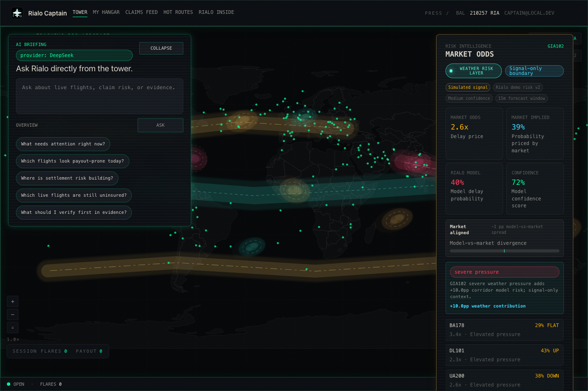
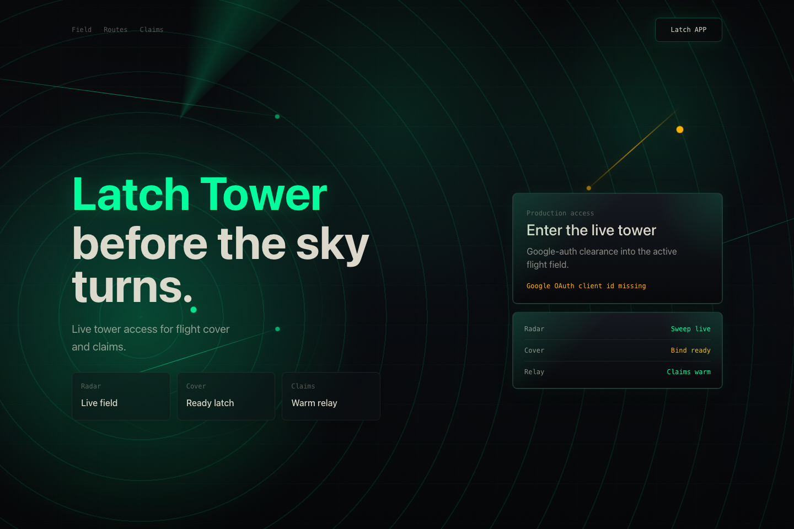
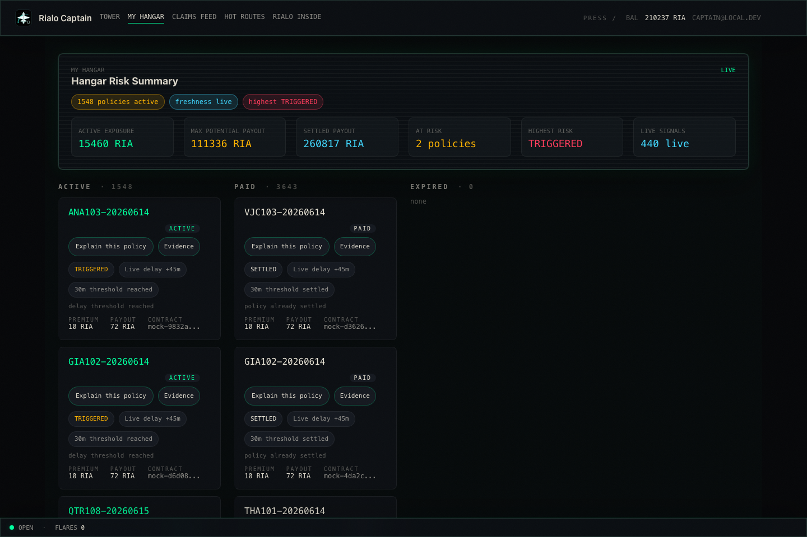
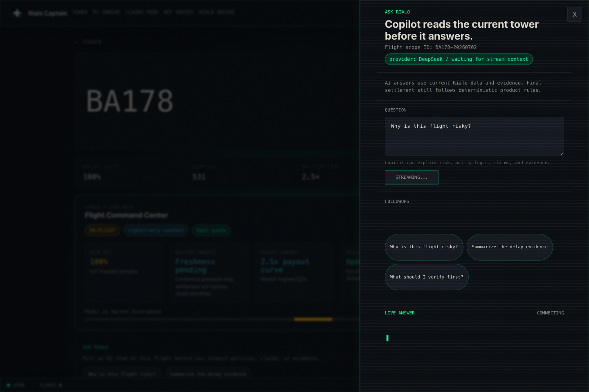
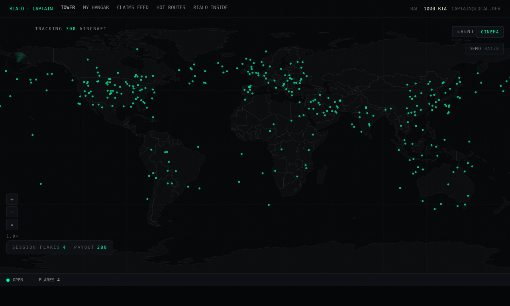
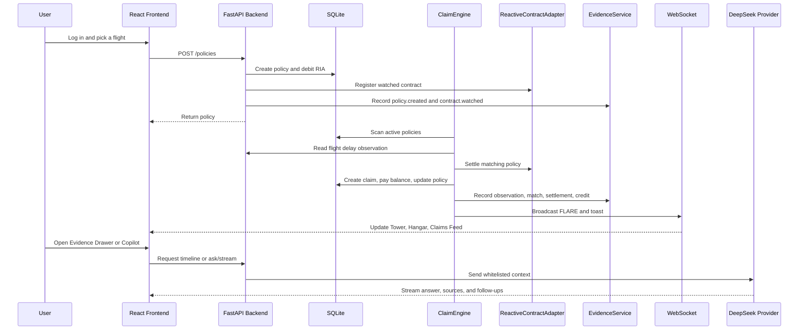
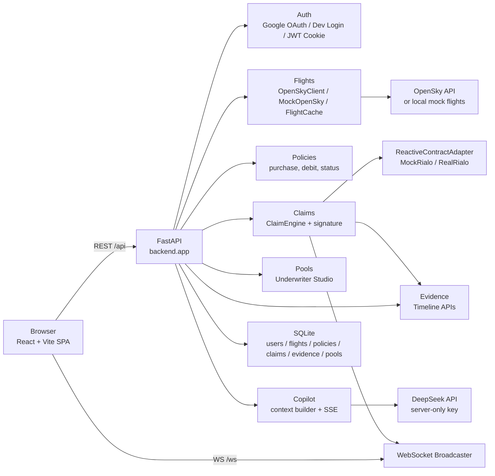

# Rialo-Captain

**Reactive flight-delay insurance for the live sky.**

Rialo-Captain is a product-grade demo for reactive insurance on Rialo. A user watches live flights on a global command center, buys delay coverage for a flight, and then sees the system settle the policy automatically when the flight delay crosses the configured threshold. The backend records every important step as settlement evidence, broadcasts real-time events to the frontend, and lets Rialo Copilot explain risk, policies, claims, and evidence using only data the current user is allowed to see.



## Table of Contents

- [What This Project Is](#what-this-project-is)
- [Screenshots](#screenshots)
- [Core Capabilities](#core-capabilities)
- [End-to-End Flow](#end-to-end-flow)
- [System Architecture](#system-architecture)
- [Technology Stack](#technology-stack)
- [Repository Layout](#repository-layout)
- [Quick Start](#quick-start)
- [Environment Variables](#environment-variables)
- [Demo Walkthroughs](#demo-walkthroughs)
- [Common API Endpoints](#common-api-endpoints)
- [Testing and Verification](#testing-and-verification)
- [Vercel Deployment](#vercel-deployment)
- [Demo-Stage Guardrails](#demo-stage-guardrails)
- [Troubleshooting](#troubleshooting)
- [Related Documents](#related-documents)

## What This Project Is

Rialo-Captain turns a full insurance lifecycle into one observable loop:

```text
live flight data -> buy delay coverage -> detect delay -> settle automatically -> replay evidence -> ask AI for explanation
```

The project is designed to show what a Rialo-style reactive contract experience can feel like when real-world data is treated as a first-class trigger. Instead of asking users to inspect a static insurance form, the product gives them a real-time command center:

- The user sees live aircraft, risk corridors, market signals, and insurance exposure in one place.
- A policy is created against a specific `flight_id`, premium tier, payout amount, and delay threshold.
- The backend watches active policies through `ClaimEngine`.
- When the observed delay reaches the rule threshold, the system creates a claim, pays the user in demo RIA, updates policy state, records evidence, and broadcasts the event.
- The evidence timeline explains what the system observed, what condition matched, what was settled, what was credited, and what final state was confirmed.
- Rialo Copilot can summarize and explain the system state, but it cannot buy insurance, change balances, trigger claims, or override deterministic settlement logic.

The result is a demo that is useful for product review, engineering onboarding, investor-facing storytelling, and regression testing.

## Screenshots

### Login and Demo Access

The login page keeps the production Google OAuth path visible while preserving the demo-stage `Latch APP` / Dev Login entry point. This allows local and live demos to start without Google OAuth setup, while keeping the production login strategy intact.



### Tower Command Center

Tower is the main stage. It combines global flights, risk corridors, weather and market risk signals, session events, WebSocket status, and inline AI Briefing.


### My Hangar

My Hangar shows the current user's active and paid policies, exposure, maximum potential payout, settled payout, risk state, and evidence entry points.



### Rialo Copilot

Copilot reads the current product context and streams answers from the configured DeepSeek provider. It can explain why a flight is risky, why a claim was paid, what evidence was used, and what the user should verify next.



### Cinema Mode

Cinema mode lets the Tower run a self-contained story when the user is idle: choose a protagonist flight, seed a policy, inject a demo delay, trigger settlement, and visualize the closed loop.



## Core Capabilities

### 1. Live Flight Risk Command Center

- `/` renders the Tower, a full-screen radar-style view of global flights.
- The app can use real OpenSky data or a local `MockOpenSky` source for stable demos.
- `FlightFetcher` refreshes flight state in the background.
- `FlightCache` protects the backend from excessive external calls.
- WebSocket `WS /ws` broadcasts `state_update`, `FLARE`, and `toast` events.
- The frontend reconnects with exponential backoff when the socket drops.
- Global shortcuts `/`, `Cmd+K`, and `Ctrl+K` open the search palette outside the login page.
- Search can match callsigns, airport codes, and origin-to-destination pairs.

### 2. Flight Delay Insurance Product

- Premium tiers are fixed at `5`, `10`, and `20` RIA.
- The default delay trigger is `30` minutes.
- Payout multiplier is derived from route delay risk: lower-delay routes pay a higher multiple, higher-delay routes pay a lower multiple.
- Buying a policy immediately deducts premium from the user's demo RIA balance.
- Active policies are visible in My Hangar and on Flight Detail.
- Related claims are visible from Flight Detail and Claims Feed.
- Insufficient balance returns `402 Payment Required`.
- Invalid premium tiers return validation errors.

### 3. Reactive Settlement Engine

- `ClaimEngine` scans active policies every 30 seconds by default.
- A targeted demo delay injection can also trigger immediate evaluation for one flight.
- When a policy qualifies, the engine creates a claim, marks the policy paid, credits the user's balance, records settlement duration, and broadcasts events.
- A single failed policy does not stop the rest of the settlement loop.
- Every claim receives a deterministic mock chain-style signature: `0x` plus 64 hexadecimal characters.
- The system uses `ReactiveContractAdapter` as the only business-facing contract interface.
- `MockRialoAdapter` powers local and demo settlement.
- `RealRialoAdapter` is reserved for a future real Rialo SDK integration.

### 4. Settlement Evidence

- Policy creation writes `policy.created`.
- Contract registration writes `contract.watched`.
- Delay observation can write `observation.received`.
- Trigger conditions write `condition.matched`.
- Claim settlement writes `claim.triggered`, `claim.settled`, `balance.credited`, and `flight.landed`.
- Timeline APIs return events in stable order.
- Users can only read evidence for policies and claims they own.
- Cross-user evidence access is hidden as `404 Not Found`.
- Evidence write failure must not roll back an already successful payout.
- Evidence Drawer loads persisted backend data; it does not rely on frontend-only WebSocket memory.

### 5. Rialo Copilot

- Backend endpoints:
  - `POST /copilot/ask`
  - `POST /copilot/ask/stream`
- Authentication uses the same HttpOnly JWT cookie as the rest of the protected app.
- DeepSeek API keys are server-only and never appear in the frontend bundle.
- Context is built from a whitelist of current-user-visible data.
- Supported subjects include overview, flight, policy, claim, evidence, and pool contexts.
- Stream events follow a stable SSE protocol: `context`, `delta`, `suggestions`, `done`, and `error`.
- Copilot can explain, summarize, navigate, and suggest verification steps.
- Copilot cannot create policies, modify policies, trigger payouts, update balances, or override ClaimEngine.

### 6. Underwriter Studio

- `/studio` provides an experimental underwriter workflow.
- A user can select a preset, adjust delay threshold, payout multiplier, route filters, and stake RIA.
- Opening a pool creates an active underwriting position.
- Pool state includes exposure, hits, paid out amount, ticker, and profit/loss.
- Rules can be patched while the pool is active.
- Closing a pool returns the calculated result and records pool timeline events.
- This feature complements the buyer-side insurance loop by showing the supply side of delay risk.

### 7. Cinema and Demo Storytelling

- Tower enters cinema mode by default after login.
- Idle cinema mode runs a repeating story cycle.
- Demo cycles can seed policies and inject delays automatically.
- Real `policy.created` events can interrupt the demo story and become the current protagonist.
- User clicks, wheel, drag, and keydown enter manual mode.
- Manual mode auto-recovers after 30 seconds of idle time.
- Pressing `Escape` exits manual mode immediately.
- The page pauses cinema automation when hidden and resumes when visible.

## End-to-End Flow



## System Architecture



Important boundaries:

- The frontend only contains public configuration.
- AI provider secrets stay on the backend.
- REST and WebSocket routes use cookie-based authentication.
- Flight data, settlement logic, contract adapter behavior, evidence writes, and Copilot context assembly all live behind backend APIs.
- Local Vite development proxies browser `/api` and `/ws` calls to the FastAPI backend.
- Vercel deployment can use a same-origin serverless demo API or connect to an external long-running backend.

## Technology Stack

| Layer | Technology |
| --- | --- |
| Backend | Python 3.11, FastAPI, SQLAlchemy 2.x async, SQLite, httpx, PyJWT, google-auth |
| Flight data | OpenSky API, MockOpenSky, FlightCache, FlightFetcher |
| Insurance logic | PolicyService, ClaimEngine, ReactiveContractAdapter, MockRialoAdapter |
| AI | DeepSeek V4 provider, SSE streaming, whitelisted context builder |
| Frontend | Vite 5, React 18, TypeScript, React Router 6, SWR, Zustand |
| Maps and visuals | Mapbox GL, deck.gl, d3-geo, topojson-client |
| Testing | pytest, pytest-asyncio, ruff, Vitest, Testing Library, Playwright |
| Deployment | Vercel SPA, FastAPI serverless demo entry, optional external API |

## Repository Layout

```text
.
├── api/                         # Vercel serverless demo entry
├── backend/                     # FastAPI backend
│   ├── admin/                   # Demo data and protected admin APIs
│   ├── auth/                    # Google OAuth, Dev Login, JWT cookies
│   ├── claims/                  # ClaimEngine, claim APIs, signatures
│   ├── contracts/               # ReactiveContractAdapter abstraction
│   ├── copilot/                 # Provider, context, REST and SSE routes
│   ├── evidence/                # Settlement evidence timelines
│   ├── flights/                 # OpenSky, mock flights, cache, routes
│   ├── policies/                # Delay insurance purchase and policy APIs
│   ├── pools/                   # Underwriter Studio pools
│   ├── ws/                      # WebSocket auth and broadcaster
│   ├── app.py                   # FastAPI app and lifespan setup
│   ├── config.py                # Backend settings
│   ├── db.py                    # Async session and DB initialization
│   └── models.py                # SQLAlchemy models
├── docs/                        # Project docs, plans, README assets
│   └── assets/readme/           # Screenshots used by this README
├── frontend/                    # React/Vite frontend
│   ├── public/
│   ├── src/
│   │   ├── api/                 # Frontend API clients
│   │   ├── auth/                # ProtectedRoute and login components
│   │   ├── components/          # Tower, Copilot, Evidence, Studio, shell UI
│   │   ├── hooks/               # SWR hooks and WebSocket hook
│   │   ├── routes/              # Page routes
│   │   ├── store/               # Zustand stores
│   │   └── tests/               # Vitest unit and component tests
│   ├── deploy.config.json       # Checked-in public deployment defaults
│   └── package.json
├── openspec/                    # Current specs and change proposals
├── scripts/dev.sh               # One-command local dev startup
├── .env.example                 # Backend environment example
├── frontend/.env.example        # Frontend environment example
├── pyproject.toml
└── package.json
```

## Quick Start

### 1. Prerequisites

Install:

- Python 3.11+
- Node.js 20+
- pnpm 9

### 2. Install Backend Dependencies

Using a local virtual environment is recommended:

```bash
python3.11 -m venv .venv
source .venv/bin/activate
pip install -e ".[dev]"
```

### 3. Install Frontend Dependencies

```bash
cd frontend
pnpm install
cd ..
```

### 4. Create Environment Files

```bash
cp .env.example .env
cp frontend/.env.example frontend/.env
```

For local demos, keep these defaults:

```dotenv
DEV_LOGIN_ENABLED=true
RIALO_MODE=mock
OPENSKY_ENABLED=false
CLAIM_ENGINE_ENABLED=true
FLIGHT_FETCHER_ENABLED=true
COOKIE_SECURE=false
```

Then add a real DeepSeek key for Copilot:

```dotenv
DEEPSEEK_API_KEY=your-real-deepseek-api-key
```

For the full map experience, add a Mapbox public token to `frontend/.env`:

```dotenv
VITE_MAPBOX_TOKEN=pk.your-mapbox-public-token
```

### 5. Start the App

```bash
./scripts/dev.sh
```

The script starts:

- Backend: `http://localhost:8000`
- Frontend: `http://localhost:5173`

Health check:

```bash
curl http://localhost:8000/health
```

Expected response:

```json
{"status":"ok","service":"rialo-captain"}
```

### 6. Log In Locally

Open `http://localhost:5173`, click `Latch APP`, and use Dev Login to enter Tower.

Dev Login is intentionally enabled during the demo stage. Do not disable it unless the product owner explicitly asks to switch to a production login strategy.

## Environment Variables

### Backend `.env`

| Variable | Default | Purpose |
| --- | --- | --- |
| `DATABASE_URL` | `sqlite+aiosqlite:///./rialo.db` | SQLite database URL |
| `JWT_SECRET` | `change-me-in-prod-32-chars-min` | JWT signing secret; replace in production |
| `JWT_COOKIE_NAME` | `rialo_session` | HttpOnly session cookie name |
| `JWT_TTL_HOURS` | `720` | Session lifetime in hours |
| `COOKIE_SECURE` | `false` | Must be false for local HTTP; true for production HTTPS |
| `DEV_LOGIN_ENABLED` | `true` | Enables `POST /auth/dev-login` |
| `GOOGLE_CLIENT_ID` | placeholder | Google OAuth client ID |
| `RIALO_MODE` | `mock` | `mock` uses MockRialoAdapter; `real` is reserved for SDK integration |
| `ADMIN_TOKEN` | `local-dev-admin-token` | Token for demo admin APIs |
| `OPENSKY_BASE_URL` | `https://opensky-network.org/api` | OpenSky API base URL |
| `OPENSKY_ENABLED` | `false` | False uses local mock flights; true calls real OpenSky |
| `MOCK_FLIGHT_COUNT` | `300` | Number of generated mock flights |
| `CLAIM_ENGINE_ENABLED` | `true` | Starts background settlement loop |
| `FLIGHT_FETCHER_ENABLED` | `true` | Starts background flight refresh |
| `LOG_LEVEL` | `INFO` | Backend log level |
| `DEEPSEEK_API_KEY` | empty | Server-only key for Rialo Copilot |
| `DEEPSEEK_MODEL` | `deepseek-v4-pro` | Default Copilot model |
| `DEEPSEEK_BASE_URL` | `https://api.deepseek.com` | DeepSeek API base URL |
| `DEEPSEEK_TIMEOUT_SECONDS` | `20` | Provider timeout |

### Frontend `frontend/.env`

| Variable | Default | Purpose |
| --- | --- | --- |
| `VITE_GOOGLE_CLIENT_ID` | placeholder | Google OAuth client ID for the browser |
| `VITE_MAPBOX_TOKEN` | placeholder | Mapbox public token |
| `VITE_DEV_LOGIN_ENABLED` | `true` | Shows the Dev Login entry point |
| `VITE_API_BASE_URL` | empty | Leave empty locally to use Vite `/api` proxy |
| `VITE_WS_BASE_URL` | empty | Leave empty locally to connect to current-host `/ws` |

### Google OAuth

Local demos can use Dev Login. To enable Google OAuth:

1. Open Google Cloud Console.
2. Create a Web application OAuth Client.
3. Add `http://localhost:5173` and `http://localhost:8000` to Authorized JavaScript origins.
4. Copy the Client ID into backend `.env` as `GOOGLE_CLIENT_ID`.
5. Copy the same Client ID into `frontend/.env` as `VITE_GOOGLE_CLIENT_ID`.

### Mapbox

Without a valid `VITE_MAPBOX_TOKEN`, the app should fail softly, but the full map experience will not be available. For demos, provide a valid public `pk...` token.

### OpenSky

Use `OPENSKY_ENABLED=false` for stable local demos. Use `OPENSKY_ENABLED=true` to call the real OpenSky public API, but expect anonymous rate limits.

## Demo Walkthroughs

### Walkthrough A: Product-Only Flow

1. Open `http://localhost:5173`.
2. Click `Latch APP`.
3. Log in with Dev Login.
4. Enter Tower and inspect live flights, risk signals, and AI Briefing.
5. Click a flight point and open the purchase drawer.
6. Buy coverage with `5`, `10`, or `20` RIA premium.
7. Open My Hangar and confirm the policy is active.
8. Inject a demo delay or wait for a qualifying event.
9. Open Claims Feed and inspect payout, signature, and settlement duration.
10. Open Evidence Drawer and replay the timeline.
11. Ask Copilot: `Why was this claim paid?` or `What should I verify first?`

### Walkthrough B: Trigger Payout from the Command Line

Log in through the frontend first so the browser has a session cookie. Then pick a known `flight_id` and inject a delay:

```bash
curl -X POST http://localhost:8000/admin/inject-delay \
  -H "Content-Type: application/json" \
  -H "X-Admin-Token: local-dev-admin-token" \
  -d '{"flight_id":"YOUR_FLIGHT_ID","delay_minutes":45}'
```

The next ClaimEngine pass should settle any active policy on that flight whose threshold is met. Some demo paths also evaluate the target flight immediately after delay injection so the closed loop appears faster.

### Walkthrough C: Seed Demo Data

```bash
curl -X POST http://localhost:8000/admin/seed-demo \
  -H "Content-Type: application/json" \
  -H "X-Admin-Token: local-dev-admin-token" \
  -d '{"user_email":"captain@local.dev","protagonist_name":"Captain Demo"}'
```

The response includes demo policy and flight details. Inject a delay for the returned `flight_id` to complete the payout story.

### Walkthrough D: Underwriter Studio

1. Open `/studio`.
2. Select an underwriting preset.
3. Adjust delay threshold, payout multiplier, route filters, and stake.
4. Open the pool.
5. Watch exposure, hits, payout, ticker, and profit/loss.
6. Use a demo delay or real event to exercise the pool.
7. Close the pool and inspect the result.

## Common API Endpoints

Browser code usually calls `/api/...`; Vite or Vercel proxies that to the backend. Direct local backend calls use `http://localhost:8000/...`.

| Feature | Method and Path | Notes |
| --- | --- | --- |
| Health check | `GET /health` | Service status |
| Google OAuth | `POST /auth/google` | Verifies Google ID token and sets JWT cookie |
| Dev Login | `POST /auth/dev-login` | Demo login controlled by `DEV_LOGIN_ENABLED` |
| Current user | `GET /me` | Returns user identity and balance |
| Live flights | `GET /flights/live` | Returns current flight state |
| Flight detail | `GET /flights/{flight_id}` | Returns flight detail, risk metrics, live delay |
| Flight track | `GET /flights/track/{icao24}` | Returns recent track data |
| Hot routes | `GET /routes/hot` | Returns route cards and real `flight_id` values |
| Create policy | `POST /policies` | Buys delay insurance |
| My policies | `GET /policies` | Lists current user's policies |
| Recent claims | `GET /claims/recent` | Supports optional `flight_id` filtering |
| Policy timeline | `GET /policies/{policy_id}/timeline` | Returns evidence timeline for a policy |
| Claim timeline | `GET /claims/{claim_id}/timeline` | Returns evidence timeline for a claim |
| Copilot ask | `POST /copilot/ask` | Non-streaming answer |
| Copilot stream | `POST /copilot/ask/stream` | SSE streaming answer |
| Create pool | `POST /pools` | Opens an Underwriter Studio pool |
| My pool | `GET /pools/me` | Returns current active pool |
| Patch pool | `PATCH /pools/{pool_id}` | Updates active pool rules |
| Close pool | `DELETE /pools/{pool_id}` | Closes pool and returns result |
| Pool timeline | `GET /pools/{pool_id}/timeline` | Returns pool events |
| Inject delay | `POST /admin/inject-delay` | Demo admin API; requires `X-Admin-Token` |
| Seed demo | `POST /admin/seed-demo` | Demo admin API; requires `X-Admin-Token` |
| Realtime events | `WS /ws` | Broadcasts state updates, FLARE events, toasts |

## Testing and Verification

### Backend Tests

```bash
pytest backend/tests -v
```

### Backend Lint

```bash
ruff check backend
```

### Frontend Unit and Component Tests

```bash
cd frontend
pnpm test
```

### Frontend Build

```bash
cd frontend
pnpm build
```

### Playwright End-to-End Tests

Install Chromium on first use:

```bash
cd frontend
pnpm exec playwright install --with-deps chromium
```

Run the tests:

```bash
cd frontend
pnpm exec playwright test
```

### Screenshot Assets Used by This README

The README screenshots are stored in:

```text
docs/assets/readme/
```

They were copied from local Playwright smoke-test output and frontend screenshot-test output. The generated source directories `output/` and `frontend/tests/screenshots/` are ignored by git, so this README references only stable documentation assets.

## Vercel Deployment

Vercel deploys the `frontend/` Vite SPA. The project can also expose a temporary FastAPI serverless demo entry under `/api/*`.

Supported import modes:

- Import the repository root: root `vercel.json` enters `frontend`, installs, validates config, and builds.
- Set Vercel Root Directory to `frontend`: `frontend/vercel.json` handles the build.

Public production defaults live in:

```text
frontend/deploy.config.json
```

Default demo-stage config:

```json
{
  "googleClientId": "",
  "mapboxToken": "pk.rialo-production-token",
  "apiBaseUrl": "",
  "wsBaseUrl": "",
  "devLoginEnabled": true
}
```

The production build runs:

```bash
node scripts/ensure-production-env.mjs
```

Validation behavior:

- When `devLoginEnabled=true`, empty `googleClientId` and `apiBaseUrl` are allowed. The frontend can use same-origin `/api/auth/dev-login`.
- When switching to production login, set `devLoginEnabled=false` and provide a real Google Client ID, API base URL, and WebSocket base URL.
- The frontend build must not require or contain `DEEPSEEK_API_KEY`.
- DeepSeek credentials belong only in the backend runtime environment.

## Demo-Stage Guardrails

### Dev Login Must Stay Available

The project is still in a demo stage, and Dev Login is a required capability. Do not delete, hide, disable, or weaken any of these without explicit product-owner approval:

- `dev login`
- `/auth/dev-login`
- `DEV_LOGIN_ENABLED`
- `VITE_DEV_LOGIN_ENABLED`
- `devLoginEnabled=true` in `frontend/deploy.config.json`
- the login page `Latch APP` entry point

Any authentication, deployment, login-page, or configuration change must verify that Dev Login is still visible and `/auth/dev-login` still works.

### Local Copilot Must Use a Real Provider

For local demos and development, Rialo Copilot must use a real AI provider by default. Dev Login is allowed for authentication, but AI answers must not be downgraded to fake, mock, offline, or provider-not-configured mode unless explicitly approved.

Before restarting the backend for a demo, confirm:

```dotenv
DEEPSEEK_API_KEY=real-key
```

Then verify through AI Briefing or the Copilot panel that `/copilot/ask` or `/copilot/ask/stream` returns a real answer.

## Troubleshooting

### Login Returns to the Login Page

Check:

- The backend is running at `http://localhost:8000`.
- `GET /me` returns 200 after login.
- `COOKIE_SECURE=false` for local HTTP.
- The browser is not blocking the local cookie.

### Dev Login Is Missing

Check:

- `.env` has `DEV_LOGIN_ENABLED=true`.
- `frontend/.env` has `VITE_DEV_LOGIN_ENABLED=true`.
- `frontend/deploy.config.json` has `devLoginEnabled=true`.
- The login page shows `Latch APP`.

### Copilot Is Unavailable

Check:

- `.env` contains a real `DEEPSEEK_API_KEY`.
- The backend process was restarted after updating `.env`.
- The DeepSeek API is reachable from the backend process.
- Backend logs for provider timeout, provider error, non-JSON response, or auth failure.

### The Map or Risk Layer Looks Incomplete

Check:

- `frontend/.env` has a valid `VITE_MAPBOX_TOKEN`.
- `OPENSKY_ENABLED=false` uses enough mock flights, for example `MOCK_FLIGHT_COUNT=300`.
- Real OpenSky mode may be rate-limited when used anonymously.

### Automatic Payout Does Not Appear

Check:

- `CLAIM_ENGINE_ENABLED=true`.
- The target policy is still `active`.
- The injected `flight_id` matches the policy flight.
- The injected delay is at least the policy threshold, usually `30` minutes.
- Claims Feed is not filtered to the wrong flight or user context.

### WebSocket Events Do Not Arrive

Check:

- The browser is logged in and carries the JWT cookie.
- The frontend connects to `/ws`.
- The backend did not reject the WebSocket upgrade.
- Local development leaves `VITE_WS_BASE_URL` empty so the frontend uses the current host.

### Vercel Build Fails

Check:

- `frontend/deploy.config.json` exists.
- If `devLoginEnabled=false`, then `googleClientId`, `apiBaseUrl`, and `wsBaseUrl` are valid.
- The validation script output usually points to the missing config.
- Do not configure DeepSeek keys in frontend variables.

## Related Documents

- [Project introduction and tutorial](docs/project-introduction-tutorial.md)
- [Current OpenSpec specs](openspec/specs/)
- [Initial Rialo-Captain design](docs/superpowers/specs/2026-06-13-rialo-captain-design.md)
- [Live Dashboard plan](docs/superpowers/plans/2026-06-14-rialo-captain-live-dashboard.md)
- [Settlement Evidence plan](docs/plans/2026-06-24-settlement-evidence-replay.md)
- [Rialo Copilot plan](docs/plans/2026-06-25-rialo-copilot-visible-ai.md)

## License

MIT
