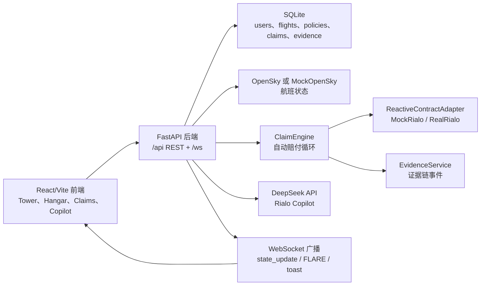

# Rialo-Captain 项目介绍与使用教程

Rialo-Captain 是一个面向 Rialo 反应式合约能力的航班延误险演示项目。它把实时航班数据、保险购买、自动赔付、证据链回放和 AI 解释串成一个完整闭环：用户在全球航班大屏上选择航班，一键购买延误险；当航班延误达到规则阈值后，后台理赔引擎自动结算并广播事件，前端展示赔付、链上风格签名和证据链，Rialo Copilot 可以基于当前用户可见数据解释风险、保单和赔付原因。

这篇教程适合发给第一次接触项目的人，帮助对方理解项目在做什么、如何在本地启动、如何完成一轮演示，以及遇到常见问题时如何排查。

## 1. 项目解决什么问题

传统航班延误险通常依赖多个外部角色：航班数据源、预言机、定时任务、人工运营后台、结算服务和客服解释链路。Rialo-Captain 要展示的是另一种体验：

1. 用户面对的是一个实时航班风险大屏，而不是一张静态保险表单。
2. 保险规则在购买时被登记为合约监听条件，例如“延误达到 30 分钟”。
3. 后台 ClaimEngine 周期性检查活动保单，一旦延误条件满足，自动创建 claim、更新用户余额、生成签名并广播实时事件。
4. 每个关键动作都写入 settlement evidence，用户可以回放“为什么赔、何时赔、依据是什么”。
5. Copilot 只做解释、总结和导航，不直接买险、不改余额、不覆盖确定性结算结果。

一句话介绍给别人：

> Rialo-Captain 是一个实时航班延误险控制台，用来演示 Rialo 如何让保险合约直接响应真实世界状态，并把赔付过程变成可解释、可回放的用户体验。

## 2. 核心功能一览

- **Tower 实时大屏**：首页 `/` 展示全球航班、风险热力、关键事件和 AI Briefing。
- **Flight Detail 航班详情**：`/flight/:id` 展示航班 KPI、延误分布、购买入口、关联保单和关联赔付。
- **My Hangar**：`/policies` 展示当前用户购买的保单、风险状态和证据入口。
- **Claims Feed**：`/claims` 展示最近自动赔付记录、赔付金额、延误分钟数、签名和证据入口。
- **Hot Routes**：`/routes` 展示热门航线和可跳转航班。
- **Rialo Inside**：`/rialo-inside` 用滚动叙事解释传统多角色架构与 Rialo 单合约架构的差异。
- **Rialo Copilot**：基于 DeepSeek provider 的流式问答，解释航班、保单、赔付和证据链。
- **Dev Login**：演示阶段默认保留本地登录入口，方便现场演示。

## 3. 系统结构



后端入口是 `backend/app.py`，前端入口是 `frontend/src/App.tsx`。本地开发时 Vite 会把 `/api` 代理到 `http://localhost:8000`，把 `/ws` 代理到后端 WebSocket。

## 4. 本地环境准备

需要安装：

- Python 3.11+
- Node.js 20+
- pnpm 9

安装依赖：

```bash
pip install -e ".[dev]"
cd frontend
pnpm install
cd ..
```

初始化环境文件：

```bash
cp .env.example .env
cp frontend/.env.example frontend/.env
```

本地演示建议保持这些默认值：

```dotenv
DEV_LOGIN_ENABLED=true
RIALO_MODE=mock
OPENSKY_ENABLED=false
CLAIM_ENGINE_ENABLED=true
FLIGHT_FETCHER_ENABLED=true
```

还需要按用途补充：

- `DEEPSEEK_API_KEY`：Copilot 必须配置真实 provider，本地演示不要降级到 fake/mock/offline。
- `VITE_MAPBOX_TOKEN`：用于地图展示；不填时页面会降级提示，但地图视觉效果不完整。
- `GOOGLE_CLIENT_ID` 和 `VITE_GOOGLE_CLIENT_ID`：只有需要 Google OAuth 登录时才必须填写；本地演示可使用 Dev Login。

## 5. 启动项目

一键启动前后端：

```bash
./scripts/dev.sh
```

启动后访问：

- 前端：`http://localhost:5173`
- 后端健康检查：`http://localhost:8000/health`
- API 代理路径：前端侧请求 `/api/...`

如果一切正常，浏览器打开首页后会进入登录页。点击 `Latch APP`，使用 `Dev Login` 登录，即可进入 Tower 大屏。

## 6. 第一次使用路线

### 6.1 登录

1. 打开 `http://localhost:5173`。
2. 点击登录页中的 `Latch APP`。
3. 在弹出的 Dev Login 面板中点击 `Dev Login`。
4. 登录成功后会进入 `/` Tower 首页。

Dev Login 是当前演示阶段的必保能力，不要在本地或演示配置里关闭。

### 6.2 浏览 Tower 大屏

Tower 是项目的主舞台。你可以在这里观察航班点位、风险摘要、事件动画和首页 AI Briefing。后台会持续拉取 OpenSky 或 MockOpenSky 数据，并通过 WebSocket 更新前端状态。

常用操作：

- 点击航班光点：在当前大屏上打开购买抽屉。
- 使用 `/`、`Cmd+K` 或 `Ctrl+K`：打开全局搜索。
- 在 AI Briefing 输入问题：让 Copilot 总结当前大屏和你的保单/赔付上下文。

### 6.3 查看航班详情

从列表页或搜索结果进入 `/flight/:id` 后，可以看到：

- 航班呼号、起降机场和状态。
- 延误率、样本数、赔付倍率、当前延误分钟数。
- 延误分布图。
- 延误险购买模块。
- 当前用户在该航班上的保单。
- 该航班相关的赔付记录。

购买延误险时，保费档位固定为 `5 / 10 / 20 RIA`，延误阈值为 `30 分钟`，赔付倍率根据航线历史延误率计算。

### 6.4 管理保单

进入 `/policies` 查看 My Hangar。这里会展示当前用户持有的保单、状态、预计触发信息和风险原因。点击保单可以进入对应航班详情；点击 Evidence 操作可以查看该保单的证据链。

### 6.5 查看赔付

进入 `/claims` 查看 Claims Feed。赔付记录会包含：

- 赔付 ID 和关联保单。
- 航班 ID。
- 赔付金额。
- 延误分钟数。
- 结算耗时。
- `0x` 开头的模拟链上签名。

如果某条赔付有证据链，可以从 Evidence Drawer 查看观测、条件命中、触发、结算、余额到账和落地确认等事件。

## 7. 演示一轮“自动赔付”闭环

最适合向别人介绍的演示顺序如下：

1. 登录进入 Tower。
2. 选择一个航班，购买 `10 RIA` 延误险。
3. 回到 My Hangar，确认保单为 active。
4. 注入一次模拟延误，让后台立即触发赔付。
5. 打开 Claims Feed，查看新增 claim。
6. 打开 Evidence Drawer，展示证据链。
7. 用 Copilot 询问“Why was this claim paid?”，让它基于证据解释。

如果你已经知道某个 `flight_id`，可以用 admin 接口注入延误：

```bash
curl -X POST http://localhost:8000/admin/inject-delay \
  -H "Content-Type: application/json" \
  -H "X-Admin-Token: local-dev-admin-token" \
  -d '{"flight_id":"YOUR_FLIGHT_ID","delay_minutes":45}'
```

演示自动造数也可以使用 seed demo 接口。默认会为 `captain@local.dev` 创建或复用用户，并给前 5 个航班创建保单：

```bash
curl -X POST http://localhost:8000/admin/seed-demo \
  -H "Content-Type: application/json" \
  -H "X-Admin-Token: local-dev-admin-token" \
  -d '{"user_email":"captain@local.dev","protagonist_name":"Captain Demo"}'
```

接口返回里会包含 `flight_id` 和 `policy_ids`。拿到 `flight_id` 后再调用 `admin/inject-delay`，即可触发赔付。

## 8. 常用 API

| 功能 | 方法和路径 | 说明 |
| --- | --- | --- |
| 健康检查 | `GET /health` | 返回服务状态 |
| Dev Login | `POST /auth/dev-login` | 本地演示登录 |
| 当前用户 | `GET /me` | 读取登录用户 |
| 实时航班 | `GET /flights/live` | 返回当前航班状态 |
| 航班详情 | `GET /flights/{flight_id}` | 返回航班详情和风险指标 |
| 航班轨迹 | `GET /flights/track/{icao24}` | 返回轨迹数据 |
| 热门航线 | `GET /routes/hot` | 返回热门航线 |
| 创建保单 | `POST /policies` | 购买延误险 |
| 我的保单 | `GET /policies` | 当前用户保单列表 |
| 最近赔付 | `GET /claims/recent` | 可用 `flight_id` 过滤 |
| 保单证据链 | `GET /policies/{policy_id}/timeline` | 查询保单 timeline |
| 赔付证据链 | `GET /claims/{claim_id}/timeline` | 查询赔付 timeline |
| Copilot 问答 | `POST /copilot/ask` | 非流式问答 |
| Copilot 流式问答 | `POST /copilot/ask/stream` | SSE 流式问答 |
| 注入延误 | `POST /admin/inject-delay` | 演示用，需要 admin token |
| 造演示数据 | `POST /admin/seed-demo` | 演示用，需要 admin token |
| WebSocket | `WS /ws` | 实时事件广播 |

前端开发时，请从浏览器侧访问 `/api/...`，Vite 会自动代理到后端；直接调后端时使用 `http://localhost:8000/...`。

## 9. 测试与验证

后端测试：

```bash
pytest backend/tests -v
```

前端单元测试：

```bash
cd frontend
pnpm test
```

前端构建：

```bash
cd frontend
pnpm build
```

Playwright 端到端测试：

```bash
cd frontend
pnpm exec playwright install --with-deps chromium
pnpm exec playwright test
```

## 10. 常见问题

### 登录后又回到登录页

检查后端是否在 `:8000` 正常运行，浏览器请求 `/api/me` 是否返回 200。本地 HTTP 环境下 `.env` 里的 `COOKIE_SECURE` 必须是 `false`。

### 首页没有真实地图

检查 `frontend/.env` 里的 `VITE_MAPBOX_TOKEN`。没有 token 时页面会降级，但无法完整展示地图体验。

### Copilot 显示不可用

检查 `.env` 中是否配置了真实 `DEEPSEEK_API_KEY`。本地演示允许 Dev Login，但 Copilot 不应降级为 fake/mock/offline。

### 航班太少或 OpenSky 不稳定

本地演示建议使用：

```dotenv
OPENSKY_ENABLED=false
MOCK_FLIGHT_COUNT=300
```

这样会使用 MockOpenSky 生成稳定航班数据，避免公共 OpenSky API 限频影响演示。

### 注入延误没有产生赔付

确认三件事：

1. `flight_id` 真实存在。
2. 当前用户已经有该航班的 active policy。
3. `CLAIM_ENGINE_ENABLED=true`，或者注入接口已经成功返回 200。

### 端口被占用

默认端口是：

- 后端：`8000`
- 前端：`5173`

如果端口被占用，先停止旧服务，再重新执行 `./scripts/dev.sh`。

## 11. 推荐讲解话术

对外介绍时，可以按这个顺序讲：

1. “这是一个实时航班延误险 demo，不是静态保险表单。”
2. “用户在 Tower 大屏上看到真实或模拟航班状态，直接选择航班购买保险。”
3. “保单创建后，后台反应式引擎持续观察航班状态；延误达到 30 分钟就自动赔付。”
4. “赔付不是黑盒，系统会记录完整证据链，并在 Claims Feed 和 Evidence Drawer 里回放。”
5. “Copilot 只解释和导航，不执行金融动作；最终结算结果由确定性规则和证据链决定。”
6. “真实 Rialo SDK 接入后，只需要替换 `RealRialoAdapter`，上层业务流程不需要重写。”

这就是 Rialo-Captain 的核心价值：把“现实世界状态变化”变成“自动、可解释、可演示的保险结算体验”。
