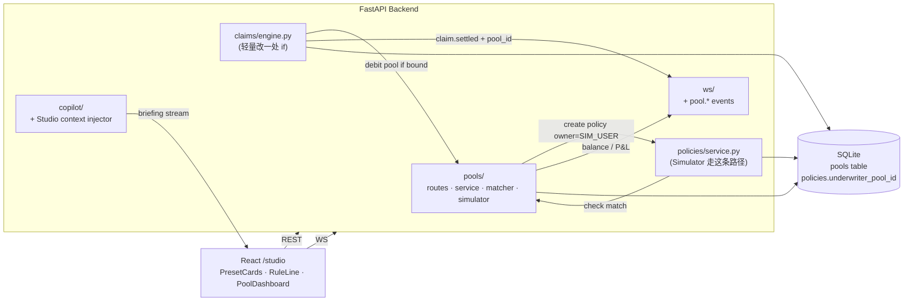

# Underwriter Studio · 设计文档

> 状态：Brainstorming 阶段产出 · 待用户最终审批 → 进入 writing-plans
> 日期：2026-07-08
> 工作名：Underwriter Studio
> Tagline：*Turn any user into a reactive underwriter — one preset click, one rule, one pool.*

---

## 0. 一句话定位

Underwriter Studio 把用户从 Rialo-Captain 现有的"投保人"角色升维成"承保人 + 规则设计师"：用户在 `/studio` 3 秒开一个承保池（点预设 · 拉 stake · 三个 chip 微调），后端一个 Passenger Simulator 持续 mock 出普通乘客买延误险的需求；符合池子规则的保单被绑到池子上（保费入池），Rialo 反应式合约照旧读实时航班状态自主结算，命中时赔付**从池子出**。承保方由"虚拟系统"换成"任意用户写的一条反应式规则"，Rialo 的"合约直接读 web2、自主结算，不需要 oracle/keeper/管理员"叙事完整闭环。

## 1. 决策摘要（brainstorming 收敛结果）

| 项 | 决策 |
| --- | --- |
| 方向 | 承保方角色（LP + 反应式规则融合）→ **Underwriter Studio** |
| 视觉 | 复用 `frontend/src/design/tokens.css` 命令中心暗色 / 雷达绿 / JetBrains Mono；**所有用户可见文案英文** |
| 入口体验 | 3 张预设卡 + 一句话可点编辑规则（Preset + Rule） |
| 规则可改范围 | 3 滑块（delay threshold / payout multiplier / stake）+ 3 chip 开关（include hubs / exclude thunderstorm / cover red-eye） |
| 池子与理赔流对接 | **真承保** + **Passenger Simulator 自动客流** |
| Tower 联动 | 5 状态（regular / underwritten dot / protagonist ring / both / claim FLARE），dot 色和 ring 分层，不冲突现有 protagonist 粉红 ring |
| 导航 | 顶部 nav 新增 `STUDIO` tab；单池 per user（partial unique index 保证） |
| Copilot | 主动 briefing + 被动问答，复用现有 Rialo Copilot AI Briefing stream |
| 破产处理 | balance ≤ 0 → 池子 `CLOSED_BANKRUPT`，已绑活跃 policy 保留跑完，balance 允许负 |
| Simulator 节奏 | 每 8–15s 随机造一次意向；保单 owner 挂在内置 `SYSTEM_SIM_USER` |
| dev 触发赔付 | Studio 页顶部隐藏一个 `Inject demo delay` 按钮，仅 `DEV_LOGIN_ENABLED=true` 可见 |
| 改规则语义 | **不追溯已绑活跃 policy**，只影响未来 Simulator 匹配 |
| Copilot 首页 hint | 每次用户没开池、访问 `/` 时提示（不做"仅首次"节流） |

## 2. 用户旅程

```
0 ─── DISCOVER ──────── 1 ─── OPEN POOL ────── 2 ─── FIRST BIND ──── 3 ─── FIRST PAYOUT ──── 4 ─── ADJUST / CLOSE
Tower nav 出现            /studio 空态页          Simulator ~10s 造        Tower FLARE + Studio      改 chip / 拉滑块
STUDIO tab + NEW badge   3 预设卡 + 规则 chip     出首单，Tower 首绿点     PAID OUT counter 滚动       或点 Close Pool
Tower 首页 Copilot        + stake 滑块 200 RIA    Studio KPI 亮 1 bound   event ticker slide-in       未命中单解绑 + stake
主动 hint                CTA [Open Pool ▸]       Copilot 主动 briefing   Copilot 二次 briefing       归还余额
```

**每一步"页面能看到 + 可交互"锚点**：

| 步 | 用户看到 | 用户能点 | 后端事件 |
|---|---------|--------|----------|
| 0 | STUDIO tab · NEW badge · Copilot hint | 点 tab 进 Studio | — |
| 1 | 预设卡 × 3 · 一句话规则 · stake 滑块 · Expected 7d hit/PL | 换预设卡 · 点 chip 弹 popover · 拉滑块 · CTA | `POST /pools` → `pool.opened` WS |
| 2 | Tower 首绿点 · Studio `bound: 1` · event ticker 新行 · Copilot briefing | 点绿点跳现有 FlightDetail | Simulator create policy + matcher 匹配 + `pool.policy_bound` WS |
| 3 | Tower 绿 FLARE · Studio `PAID OUT` counter · event ticker 高亮行 · Copilot briefing | 点 event 行看 Evidence Drawer（已有）| ClaimEngine 原流程 + `pool.balance` 扣款 + `pool.claim_paid` WS |
| 4 | 规则 chip 高亮变化 · Tower 绿点集合动态增减 · Copilot 二次 briefing | chip 改开关 · 滑块调阈值/倍数/stake · `Close Pool` | `PATCH /pools/{id}` · `DELETE /pools/{id}` |

**关键 UX 保障**：
- 步 2 首单绑定必须在 15 秒内发生（Simulator 节奏保证），避免"以为坏了"
- 步 3 现场演示用 dev inject-delay 按钮一键触发，不用等真延误
- 步 4 改规则**不追溯已绑单**（Gaming 防护 + 复杂度控制）

**跳过的路径**（Phase 2 不做）：池子转让 / 二级市场 / 分层承保（Senior/Junior） / 多池并列 / 保单转让。

## 3. 系统架构



### 3.1 前端

**新增**：

```
frontend/src/
├── routes/StudioShell.tsx              # /studio 页 (empty / active 二态)
├── components/studio/
│   ├── PresetCards.tsx
│   ├── RuleLine.tsx
│   ├── RuleChipEditor.tsx
│   ├── StakeSlider.tsx
│   ├── PoolDashboard.tsx               # KPI band + event ticker
│   ├── PoolCopilotPanel.tsx            # 复用现有 AI briefing stream
│   └── DevInjectDelayButton.tsx        # 仅 dev-login 可见
├── api/pool.ts                         # REST + WS hook
└── store/pool.ts                       # 池子 + 承保航班 id set 全局态
```

**修改**：

| 文件 | 改动 |
|------|------|
| `frontend/src/App.tsx` | 加 `/studio` route |
| `components/shell/TopNav.tsx` | 加 STUDIO tab，池活跃时显示 P/L badge（正雷达绿 / 负琥珀 amber） |
| `components/tower/GlobeMap.tsx` | flight-dot 根据 `underwritten_by_pool_id` 加 `.flight-dot--mine` class；订阅 `pool.claim_paid` WS 时插 FLARE 元素 |
| `components/tower/GlobeMap.css` | 新增 `.flight-dot--mine`（`fill: var(--accent-radar); filter: drop-shadow(0 0 6px var(--accent-radar))`）；复用现有 `flare-burst` keyframe |

### 3.2 后端

**新增模块**：

```
backend/pools/
├── __init__.py
├── routes.py         # POST /pools · GET /pools/me · PATCH · DELETE · GET timeline
├── service.py        # 池 CRUD · stake · 破产判定
├── schemas.py        # Pydantic
├── matcher.py        # 纯函数: match(pool, flight, tier) -> bool
└── simulator.py      # PassengerSimulator async loop
```

**修改**：

| 文件 | 改动 |
|------|------|
| `backend/models.py` | 新增 `Pool` model + `PoolStatus / PresetStyle` enum；`Policy` 加 `underwriter_pool_id: str \| None` |
| `backend/claims/engine.py` | 结算时 `if policy.underwriter_pool_id: pool.balance -= payout; else: 原逻辑`；balance ≤ 0 → `pools.service.close_pool(bankrupt)` |
| `backend/copilot/` | 新增 Studio 上下文注入器（pool + 关联 policies/claims → system prompt 前缀） |
| `backend/app.py` | 启动时 spawn `PassengerSimulator` async task，受 `POOL_SIMULATOR_ENABLED` gate |
| `backend/ws/` | 新事件类型 `pool.opened / pool.policy_bound / pool.claim_paid / pool.rule_updated / pool.closed`；`claim.settled` payload 加 `pool_id: str \| null` |
| `backend/config.py` | `POOL_SIMULATOR_ENABLED` `POOL_SIMULATOR_INTERVAL_MIN=8` `POOL_SIMULATOR_INTERVAL_MAX=15` `POOL_MAX_POLICIES_PER_POOL=100` |

### 3.3 数据流关键路径

```
Passenger Simulator loop (POOL_SIMULATOR_INTERVAL_MIN..MAX 随机秒)
  └── 挑一个活跃 flight (延误概率高的权重更高)
      └── 用 SYSTEM_SIM_USER 名义 create policy (premium 随机 5|10|20)
          └── matcher.first_match(policy, all_active_pools) → pool | None
              ├── 有池: policy.underwriter_pool_id = pool.id
              │         pool.balance += premium
              │         broadcast pool.policy_bound
              └── 无池: policy.underwriter_pool_id = None (走系统承保, 现有行为)

ClaimEngine (现有 30s 循环, 不动核心结构)
  └── 检测到 delay >= threshold_min → ClaimsService.create_claim (现有)
      └── if policy.underwriter_pool_id:
            pool.balance -= claim.payout
            if pool.balance <= 0 after tick: pools.service.close_pool(bankrupt)
            broadcast pool.claim_paid
          else:
            (现有虚拟系统承保行为)
```

## 4. 数据模型

```python
class PoolStatus(str, enum.Enum):
    ACTIVE = "active"
    CLOSED_BY_USER = "closed_by_user"
    CLOSED_BANKRUPT = "closed_bankrupt"

class PresetStyle(str, enum.Enum):
    STEADY = "steady"
    STORM = "storm"
    HUB = "hub"
    CUSTOM = "custom"

class Pool(Base):
    __tablename__ = "pools"
    id: Mapped[str] = mapped_column(String(32), primary_key=True, default=_uuid)
    user_id: Mapped[str] = mapped_column(ForeignKey("users.id"))
    preset_style: Mapped[PresetStyle] = mapped_column(Enum(PresetStyle))
    delay_threshold_min: Mapped[int] = mapped_column(Integer)
    payout_multiplier: Mapped[float] = mapped_column(Float)
    stake_ria: Mapped[int] = mapped_column(Integer)
    balance: Mapped[int] = mapped_column(Integer)
    include_hubs: Mapped[bool] = mapped_column(Boolean)
    exclude_thunderstorm: Mapped[bool] = mapped_column(Boolean)
    cover_red_eye: Mapped[bool] = mapped_column(Boolean)
    status: Mapped[PoolStatus] = mapped_column(Enum(PoolStatus))
    created_at: Mapped[int] = mapped_column(Integer, default=_now)
    closed_at: Mapped[int] = mapped_column(Integer, default=0)

class Policy(Base):
    # 现有字段不变
    underwriter_pool_id: Mapped[str | None] = mapped_column(
        ForeignKey("pools.id"), nullable=True
    )
```

**单池唯一约束**（DB 层，database-native）：

```sql
CREATE UNIQUE INDEX ix_pools_active_per_user
  ON pools(user_id) WHERE status = 'active';
```

SQLite 3.8+ 与 PostgreSQL 均支持 partial unique index，无需应用层锁。

**预设风格默认值**（用户点预设卡时的 baseline）：

| Preset | delay | multiplier | include_hubs | exclude_thunderstorm | cover_red_eye |
|--------|-------|------------|--------------|-----------------------|---------------|
| Steady Skies | 30 | 3.0 | true | true | false |
| Storm Chaser | 30 | 5.0 | true | false | true |
| Hub Hunter | 30 | 2.0 | true (only hubs) | true | true |
| Custom | 30 | 3.0 | true | true | false |

**Hub 白名单**（`Hub Hunter` preset 与 `include_hubs` chip 的判定依据）：`SFO, JFK, LHR, HND, LAX, ORD, DXB, SIN, CDG, FRA`。可从 `backend/pools/matcher.py` 常量维护。

## 5. API 契约

| Method | Path | Body / Params | Response | 说明 |
|--------|------|---------------|----------|------|
| `POST` | `/pools` | `preset_style · delay_threshold_min · payout_multiplier · stake_ria · include_hubs · exclude_thunderstorm · cover_red_eye` | `Pool` (201) 或 409（已有活跃池）| 创建活跃池，扣除 user.balance = stake_ria |
| `GET` | `/pools/me` | — | `Pool \| null` | 当前用户活跃池 |
| `PATCH` | `/pools/{id}` | `delay_threshold_min? · payout_multiplier? · 3 toggle?` | `Pool` | **不能改 stake**；不追溯已绑 policy；广播 `pool.rule_updated` |
| `DELETE` | `/pools/{id}` | — | `{ closed_at, returned_ria }` | 平仓：unbind 未命中活跃 policy（`underwriter_pool_id = null`）；`pool.balance + refundable stake` 归还 `user.balance`；广播 `pool.closed(reason=user)` |
| `GET` | `/pools/{id}/timeline` | `?limit=50` | `list[PoolEvent]` | 池子事件流：opened / bound / paid / rule_updated / closed |

**WS 事件 payload 精简 schema**：

```json
{ "type": "pool.opened",        "payload": { "pool_id", "preset", "rule", "stake_ria" } }
{ "type": "pool.policy_bound",  "payload": { "pool_id", "policy_id", "flight_id", "callsign", "premium", "exposure_after" } }
{ "type": "pool.claim_paid",    "payload": { "pool_id", "policy_id", "flight_id", "callsign", "payout", "balance_after", "pl" } }
{ "type": "pool.rule_updated",  "payload": { "pool_id", "new_rule" } }
{ "type": "pool.closed",        "payload": { "pool_id", "reason": "user|bankrupt", "final_pl" } }
```

现有 `flight` state broadcast 的 payload 里加：`underwritten_by_pool_id: string | null`（让 Tower 前端能给对应 dot 加 `.flight-dot--mine`）。

## 6. UI 设计约束

**风格 tokens**（严格遵守，全部从 `frontend/src/design/tokens.css` 消费）：
- 承保绿：`--accent-radar` `#00FF9D`
- P/L 正：`--accent-radar`；P/L 负：`--warn-amber` `#FFB400`（不用 `--danger-flare` 红，避免误报为系统错误）
- Protagonist ring（现有）：`rgba(255, 68, 128, 0.95)` — Underwriter 侧**不得使用**
- 字体：Geist / Söhne UI，JetBrains Mono / IBM Plex Mono 数字
- Chip / Pill 复用 `.signal-pill` 现有 class 变体
- Scanline / grain 保留

**文案语言**：全英文。用户看到的所有 label、button、tooltip、toast、event ticker 消息、Copilot briefing 均为英文（Copilot 问答内容遵从用户输入语言，不受此约束）。

**`/studio` 页两态**：

| 态 | 布局 |
|----|------|
| Empty | 上：`Underwrite delay risk in 3 seconds.` 标题 + 3 预设卡 · 中：一句话规则 chip 行 · 下：stake slider + Expected 7d hit/PL + CTA `OPEN POOL ▸` · 右侧：Copilot 面板首屏 briefing |
| Active | 上：KPI band（EXPOSURE / HITS 24H / PAID OUT / P/L）+ 一句话规则（原地可改） · 中：event ticker 滚动 bind/paid 行 · 下：CTA `CLOSE POOL` · 右侧：Copilot 面板持续 briefing |

**Tower flight-dot 视觉状态机**（已在 brainstorming 敲定）：

| 状态 | 外圈 ring | 内点 color | 事件层 |
|------|----------|-----------|--------|
| Regular | — | `--accent-weather` blue | — |
| Underwritten | — | `--accent-radar` green + glow | — |
| Protagonist | 粉红双层 breathe ring | 默认 blue dot | — |
| Both (protagonist + underwritten) | 粉红 ring (外) | 绿 dot (内) | — |
| Claim paid by my pool | 视保单状态 | 视保单状态 | 1.4s `flare-burst` green pulse |

三个视觉通道正交：**ring (radius+hue) / dot color / event pulse duration** 各自独立，同一航班可叠加所有状态而不冲突。

**TopNav STUDIO tab badge 规则**：
- 无池：`STUDIO`
- 有池 & P/L ≥ 0：`STUDIO · +N`（雷达绿）
- 有池 & P/L < 0：`STUDIO · −N`（琥珀 amber）
- 破产瞬间 1s：`STUDIO · CLOSED`（amber），随后回到 `STUDIO`

**Copilot 主动 briefing 触发点**：
- 页面初次加载（无池）：推荐入门 preset
- Pool opened 后 3s：确认承保上线 briefing
- 首次 bind：报道首单
- 每累计 5 次 bind 或每次 payout：更新战况
- 破产关闭：解释原因

## 7. 错误与边界

| 场景 | 处理 |
|------|------|
| 已有活跃池又调 `POST /pools` | 409 Conflict + 前端 toast "You already have an active pool — close it first" |
| PATCH 规则时新倍数会让未来赔付 P/L 显著变差 | 允许（不追溯已绑单，不动 balance）；前端在规则行下方给 amber 小字 "Higher multiplier increases forward payout exposure" |
| Simulator 挂 / 后端重启 | Simulator 是幂等 loop，重启自动继续；无需持久化 cursor |
| 单 tick 多单命中致 balance 跌破 0 | 允许 balance 负；完成当前 tick 全部结算再触发 `close_pool(bankrupt)`，避免中途竞态 |
| 多标签规则不同步 | `pool.rule_updated` 广播给当前用户所有 WS 连接；前端 SWR revalidate |
| Copilot 报错 / 超时 | 现有 fallback（"Copilot is briefly unavailable"）复用 |
| 无 Mapbox token / 无 dev-login | Studio 页与 Tower 一样降级；Studio 主体（预设 · 规则 · KPI）不依赖 map，全部能用 |
| DELETE 时正在赔付某已绑单 | DELETE 只 unbind 未命中活跃 policy；正在结算中的锁在 ClaimEngine 事务里，等其完成 |

## 8. 测试策略

**后端**（pytest + pytest-asyncio）：

- `pools/tests/test_matcher.py` — 纯函数覆盖 12+ 组合（3 preset × 4 边界）
- `pools/tests/test_service.py` — 开池 · 单池唯一约束 · patch · 平仓 · 破产 · SYSTEM_SIM_USER 造单
- `pools/tests/test_simulator.py` — mock time 验证节奏区间、航班挑选分布
- `claims/tests/test_engine_pool_payout.py`（新增）— bind → inject-delay → pool balance 扣款 → WS payload 完整
- 现有 `claims/tests/test_engine.py` 不动，保证无池路径回归

**前端**（Vitest + @testing-library/react + Playwright）：

- `studio/PresetCards.test.tsx` — 切卡触发 chip 状态变化
- `studio/RuleLine.test.tsx` — chip 点击弹 popover，改回写
- `studio/StudioShell.test.tsx` — empty ↔ active 二态切换（mock SWR）
- `store/pool.test.ts` — WS 事件驱动的承保航班 id set 更新
- `tests/e2e/studio-open-to-first-bind.spec.ts` — 登录 → /studio → 点 Steady → Open → 等 <20s 首单 → 断言 KPI `bound: 1`
- `tests/e2e/studio-inject-payout.spec.ts` — 开池 → dev inject-delay → Tower FLARE 元素出现 → Studio PAID OUT counter 更新

**契约测试**：WS payload 新事件加 snapshot；现有 snapshot 不动。

## 9. 演示脚本（现场 3 分钟）

1. `./scripts/dev.sh` → 登录 → 进 Tower
2. Copilot 提示 "Try underwriting" → 点 STUDIO tab
3. 点 **Storm Chaser** 卡 → CTA `Open Pool ▸`
4. Tower 页切回，出现绿点（Simulator 首单 ~10s 后）；旁白："你看这些绿点，是我这个池子承保过的航班"
5. Studio 顶部隐藏按钮 `Inject demo delay` 触发赔付 → Tower 绿 FLARE + Studio PAID OUT +XX
6. Copilot briefing 自动更新 → 展示"为什么赔付、金额、下一步风险"
7. 演示改规则：把 `exclude thunderstorm` 打开 → 说"看，命中率从 22% 降到 11%"，多个绿点因不再匹配而消失
8. `Close Pool` → stake 归还余额 → 结束 demo

## 10. Rollout / Feature Flag

- **无独立 feature flag**：MVP 阶段一次性 ship，Studio tab、`/studio` route、`pools/` 模块都直接进 main
- 唯一后端开关：`POOL_SIMULATOR_ENABLED`（默认 `true`）关掉时 Simulator 不 spawn，Studio 页仍能开池，只是不会有自动客流
- DB 迁移：一次性把 `pools` 表 + `policies.underwriter_pool_id` 列加进去；沿用项目现有的 `init_db` 或 Alembic pipeline
- 现有 6 页面（Tower / Flight / Hangar / Claims / Routes / Rialo Inside）语义**不变**，Underwriter Studio 是叠加层，对现有 API 不做破坏性改动

## 11. 开放问题（供最终 review 讨论）

以下决策**已经在 brainstorming 里由用户确认**，但列出便于最终 review 二次核对：

1. **改规则不追溯已绑单** — 用户已确认接受
2. **破产后已绑 policy 保留跑完、balance 允许负** — 用户已确认接受
3. **SYSTEM_SIM_USER 隐藏不可登录** — 用户已确认接受
4. **Copilot hint 每次没开池就在 Tower 首页提示**（不做首次节流）— 用户已确认接受
5. **dev inject-delay 按钮在 Studio 页**（Tower 页也保留现有 admin/inject-delay API）— 用户已确认接受

## 12. Phase 2 (显式不做)

以下明确不在本次范围，避免范围膨胀：

- 保单二级市场 / 池子转让
- Senior/Junior tranche 分层承保
- 一个用户多池并列比较
- 保单转让
- 承保规则 DAG 拖拽画布
- 池子的历史真实回测（当前 Expected 数字用 preset baseline 计算，非真历史）

---

*Design 结束。等待用户 review。批准后调用 `superpowers:writing-plans` skill 出实施计划，最终实现按项目 memory 交由 Codex 接手。*
